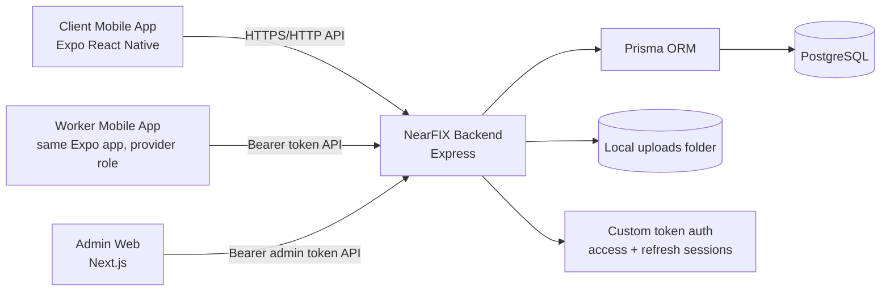
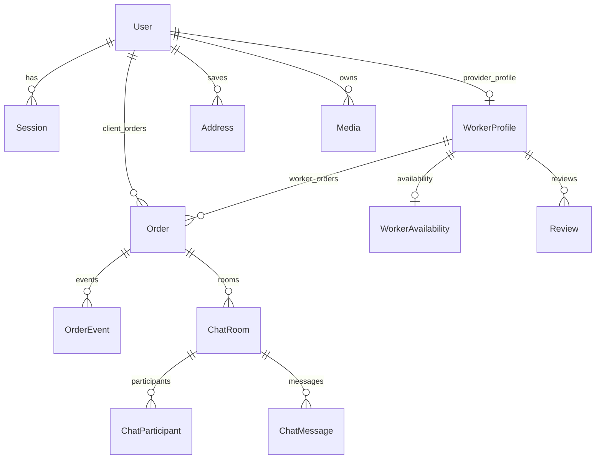
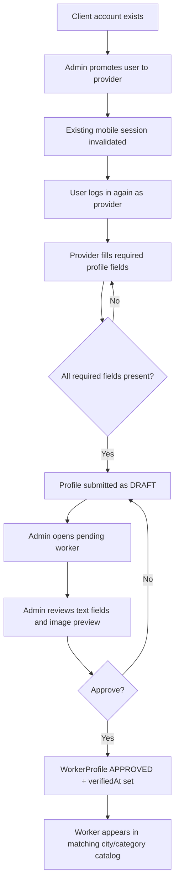
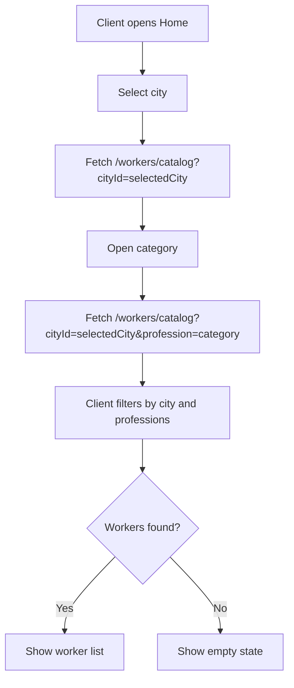
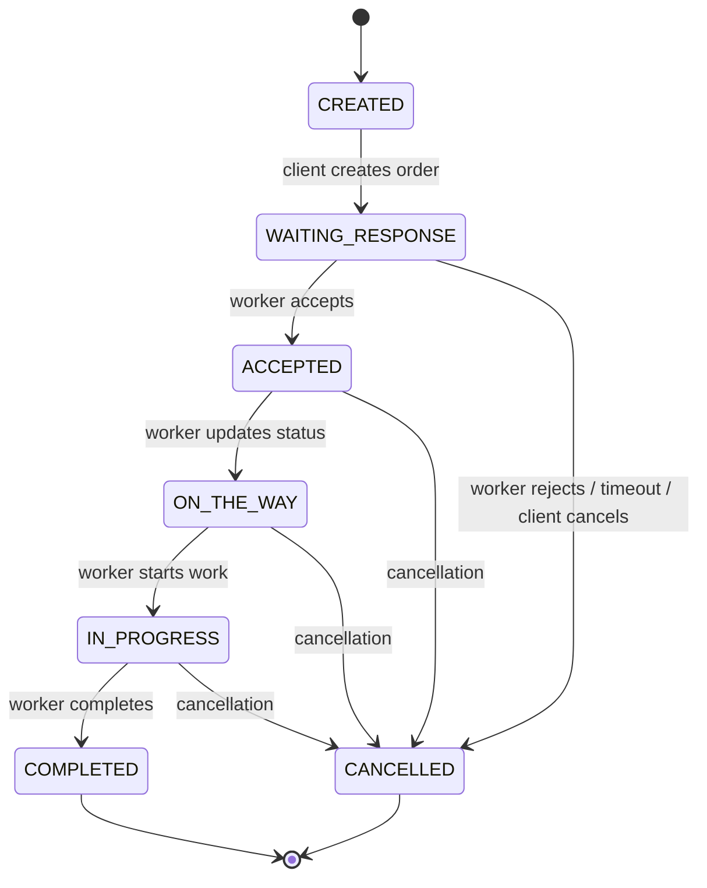
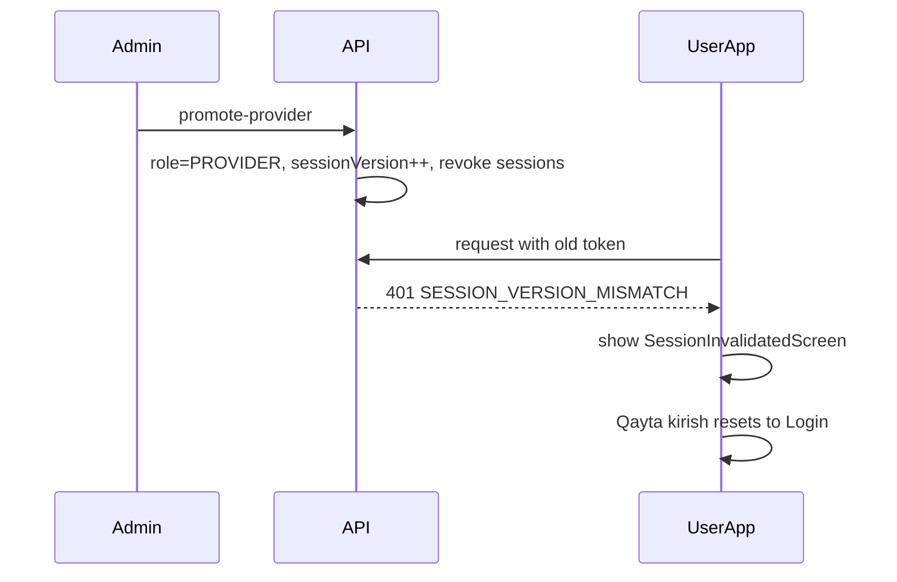

# NearFIX Audit Overview

Date: 2026-05-30

## 1. Scope

This document summarizes the current NearFIX project for audit and review:

- Mobile app: Expo React Native in `src/`
- Backend API: Express + Prisma + PostgreSQL in `backend/`
- Admin web: Next.js in `admin-web/`
- Database model: Prisma schema in `backend/prisma/schema.prisma`
- Runtime config: root `.env`, `backend/.env`, `admin-web/.env.local`

## 2. System Architecture

### Runtime Services

| Service | Path | Default port | Purpose |
|---|---:|---:|---|
| Mobile Metro | project root | `8081` | Expo bundle for client/worker app |
| Backend API | `backend/` | `4000` | API, auth, orders, workers, chats, media |
| Admin web | `admin-web/` | `3000` | Operational dashboard and approvals |
| PostgreSQL | external/local | `5432` | Persistent data |

## 3. High-Level Modules

### Mobile App

- `src/navigation/AppNavigator.js`: switches between auth, client, and worker navigators by session role.
- `src/store/authStore.js`: persisted auth session, refresh, invalidation handling.
- `src/store/clientStore.js`: catalog, orders, favorites, saved addresses.
- `src/store/workerStore.js`: worker profile, availability, incoming jobs.
- `src/services/api/*`: base API and authenticated request wrappers.
- `src/screens/marketplace/*`: client catalog, categories, booking, worker profile.
- `src/screens/worker/*`: worker dashboard, jobs, earnings, support, profile management.

### Backend

- `backend/src/http/app.ts`: Express app composition and route mounting.
- `backend/src/modules/auth`: phone login, access/refresh token sessions, role auth.
- `backend/src/modules/workers`: public catalog, worker profile, availability, approval helpers.
- `backend/src/modules/admin`: admin dashboard, users, workers, orders, reviews, approvals.
- `backend/src/modules/orders`: order lifecycle and provider actions.
- `backend/src/modules/chats`: direct/order/group/support rooms and messages.
- `backend/src/modules/media`: multipart upload and local static media serving.
- `backend/src/modules/addresses`, `favorites`: user-owned resources.

### Admin Web

- `admin-web/app/(dashboard)/*`: admin pages.
- `admin-web/modules/workers/*`: worker listing and approval flow.
- `admin-web/services/api-client.ts`: API client and admin token access.
- `admin-web/shared/components/*`: common UI tables, badges, topbar/sidebar.

## 4. Data Model Summary

Core entities:

- `User`: phone identity, role (`CLIENT`, `PROVIDER`, `ADMIN`), status, city, sessionVersion.
- `Session`: hashed refresh token, expiry, revocation.
- `WorkerProfile`: provider profile, approval status, professions, image, bio, price, rating.
- `WorkerAvailability`: `AVAILABLE`, `BUSY`, `OFFLINE`, active-order lock.
- `Order`: client request assigned to one worker, lifecycle status, address, city, service.
- `OrderEvent`: audit trail for order status changes.
- `Address`: client saved addresses.
- `Favorite`: client-worker favorite relation.
- `ChatRoom`, `ChatParticipant`, `ChatMessage`: messaging.
- `Media`: uploaded images/videos with scope and owner.
- `Review`, `Payment`, `Notification`: supporting marketplace entities.

## 5. BPMN-Style Business Processes

### 5.1 Worker Onboarding and Approval

Required worker profile fields:

- name
- cityId
- professions/profession
- experienceYears
- profileImageUrl
- basePrice
- bio

### 5.2 Client Catalog Discovery

### 5.3 Order Lifecycle

### 5.4 Session Invalidation After Role Change

## 6. API Surface

### Public

| Method | Path | Auth | Purpose |
|---|---|---|---|
| `GET` | `/health` | no | health check |
| `GET` | `/workers/catalog` | no | approved worker catalog by `cityId`, `profession/category` |
| `POST` | `/auth/register/otp/request` | no | request registration OTP |
| `POST` | `/auth/register/otp/verify` | no | verify registration OTP, set password and create session |
| `POST` | `/auth/login` | no | phone/password login |
| `POST` | `/auth/password/forgot/request` | no | request password-reset OTP |
| `POST` | `/auth/password/forgot/verify` | no | verify password-reset OTP and set new password |
| `POST` | `/auth/refresh` | no | refresh access token |

### Authenticated

| Method | Path | Roles | Purpose |
|---|---|---|---|
| `GET` | `/auth/me` | any | current session user |
| `POST` | `/auth/logout` | any | revoke current session |
| `GET/POST/PATCH/DELETE` | `/addresses` | any | saved addresses |
| `GET/POST/DELETE` | `/favorites` | any | favorite workers |
| `POST` | `/orders` | client/provider currently auth-only | create order |
| `GET` | `/orders` | any | list user orders |
| `GET` | `/orders/:orderId` | participant | get order |
| `POST` | `/orders/:orderId/cancel` | participant | cancel order |
| `GET/POST/PATCH` | `/chats/...` | room participant | chat rooms/messages/read |
| `POST` | `/media/upload` | any | upload image/video |

### Provider

| Method | Path | Purpose |
|---|---|---|
| `GET` | `/workers/me` | own worker profile |
| `PATCH` | `/workers/me/profile` | submit/update worker profile |
| `PATCH` | `/workers/me/availability` | set availability after approval |
| `GET` | `/orders/worker/incoming` | incoming requests |
| `POST` | `/orders/:orderId/accept` | accept order |
| `POST` | `/orders/:orderId/reject` | reject order |
| `POST` | `/orders/:orderId/status` | transition active order |

### Admin

| Method | Path | Purpose |
|---|---|---|
| `GET` | `/admin/dashboard` | operational summary |
| `GET` | `/admin/users` | list users |
| `GET` | `/admin/workers` | list worker profiles |
| `POST` | `/admin/users/:userId/promote-provider` | promote user to provider |
| `POST` | `/admin/workers/:workerId/approve` | approve complete worker profile |
| `GET` | `/admin/orders` | list orders |
| `GET` | `/admin/reviews` | list reviews |
| `POST` | `/orders/system/expire-waiting` | expire waiting orders |

## 7. Security Model

### Authentication

- Login is phone-based with a fake OTP provider in development.
- Access token:
  - custom HMAC SHA-256 JWT-like token
  - 15 minute TTL
  - contains `userId`, `sessionId`, `sessionVersion`, `exp`
- Refresh token:
  - random 32-byte hex string
  - hashed with SHA-256 in DB
  - persisted in `Session`
  - revocable
- Role change:
  - increments `sessionVersion`
  - revokes active sessions
  - old access tokens fail with session mismatch.

### Authorization

- `authenticate` middleware validates bearer access token and loads session user.
- `requireRole("ADMIN")` and `requireRole("PROVIDER")` enforce admin/provider access.
- User-owned resources:
  - addresses are scoped by `userId`
  - favorites are scoped by client `userId`
  - orders are fetched through participant-aware service methods
  - chat rooms/messages verify room access.

### Input Validation

- Zod schemas validate route inputs.
- Prisma enforces enum/domain constraints and relational integrity.
- Media upload filters MIME type and limits file size to 100 MB.

### Media Security

Current behavior:

- Uploaded media is saved to local `uploads/`.
- Files are served publicly via `/uploads`.
- API stores media owner and scope.

Risks:

- Public uploads are guessable if URL leaks.
- No malware scanning.
- No image resizing/metadata stripping.
- 100 MB is high for mobile image use cases.

Recommended:

- Store media in object storage with private bucket + signed URLs.
- Separate image and video size limits.
- Strip EXIF metadata for profile/order images.
- Add server-side image validation/resizing.
- Add content scanning before publication.

## 8. Security Findings and Recommendations

### Critical / High

1. Default token secret exists in code.
   - File: `backend/src/modules/auth/session.ts`
   - Risk: production compromise if `ACCESS_TOKEN_SECRET` or `SESSION_SECRET` is not set.
   - Fix: require a strong secret in non-development environments.

2. Fake OTP provider is used by default.
   - File: `backend/src/modules/auth/auth.service.ts`
   - Risk: any phone can login with development OTP behavior.
   - Fix: gate fake provider to development only and integrate real OTP before production.

3. Admin token handling needs review.
   - Admin web uses a client-side token helper.
   - Risk depends on implementation and storage.
   - Fix: prefer secure HTTP-only cookies or a formal admin auth session.

### Medium

4. No explicit rate limiting on login, refresh, upload, or order creation.
   - Add IP/user/phone based throttling.

5. CORS is currently open.
   - File: `backend/src/http/app.ts`
   - Add environment-specific origin allowlist.

6. Public upload serving has no access policy.
   - Acceptable for public profile photos, risky for chat/order media.

7. No structured audit log for admin actions.
   - Current `actorId` is returned in responses, but durable admin action audit trail is missing.
   - Add `AdminAuditLog` table for promote/approve/suspend/review actions.

8. Order creation route is auth-only, not client-only.
   - Review whether providers/admins should create client orders.

### Low / Hardening

9. Passwordless OTP code is not expiration-bound in current fake implementation.
10. No centralized request ID/log correlation.
11. No security headers middleware such as `helmet`.
12. No automated tests covering auth/session invalidation and worker approval.

## 9. Business Rule Checklist

Worker approval:

- `status=DRAFT` until admin approval.
- Required before submit/approval:
  - name
  - cityId
  - professions
  - experienceYears
  - profileImageUrl
  - basePrice
  - bio
- Approved workers appear only in matching city/category catalog.
- Offline workers still appear in catalog but cannot be booked if booking logic requires availability.

Client catalog:

- `selectedCityId` controls API query.
- Category screen must match any item in `worker.professions`, not only primary `profession`.

Order booking:

- Worker must be approved.
- Worker availability must be `AVAILABLE` to lock for a new order.
- Active order sets worker availability lock.

## 10. Operational Audit Checklist

Before production:

- Set `ACCESS_TOKEN_SECRET`/`SESSION_SECRET`.
- Replace fake OTP provider.
- Configure production `DATABASE_URL`.
- Configure CORS allowlist.
- Add rate limits.
- Add secure admin auth.
- Move uploads to private object storage.
- Add request logging and admin audit logging.
- Add backup/restore plan for PostgreSQL.
- Add automated test suite:
  - auth login/refresh/logout
  - role promotion/session invalidation
  - worker profile completion and approval
  - catalog city/category matching
  - order lifecycle
  - chat room access control
  - media upload validation

## 11. Current Local URLs

- Mobile Expo: `exp://192.168.0.105:8081`
- Backend: `http://localhost:4000`
- Admin web: `http://localhost:3000`
